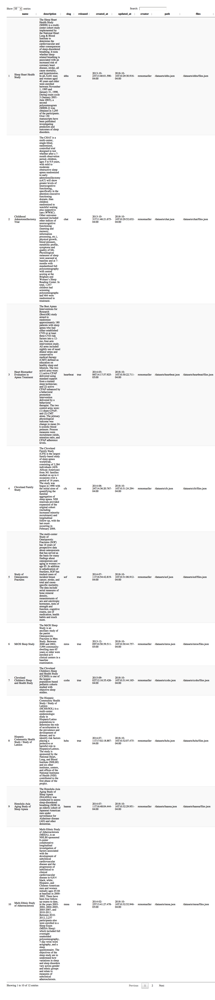

<!-- README.md is generated from README.Rmd. Please edit that file -->

# nsrr

<!-- badges: start -->

[](https://travis-ci.com/muschellij2/nsrr)
[](https://ci.appveyor.com/project/muschellij2/nsrr)
[](https://codecov.io/gh/muschellij2/nsrr)
<!-- badges: end -->

The goal of nsrr is to allow users to access data from the National
Sleep Research Resource (’NSRR’) (<https://sleepdata.org/>).

## Installation

You can install the released version of nsrr from
[CRAN](https://CRAN.R-project.org) with:

``` r
install.packages("nsrr")
```

## Token

To retrieve your NSRR token, go to <https://sleepdata.org/dashboard>,
and sign in. This token will allow you access to any data sets you have
requested access to. If you do not have access, then it will allow you
to download files that are publicly available.

Set the token by adding this to your `~/.Renviron` file:

``` r
NSRR_TOKEN="YOUR TOKEN GOES HERE"
```

The token is accessible via `token = Sys.getenv("NSRR_TOKEN")`. Each
`nsrr` function also has the argument `token` to pass through if you do
not wish to set it.

To determine if you are authenticated, you can use:

``` r
library(nsrr)
nsrr_auth()
$authenticated
[1] FALSE
```

## Examples

### NSRR data sets

Here is how you can access the NSRR datasets list:

``` r
library(nsrr)
df = nsrr_datasets()
DT::datatable(df)
```



### NSRR data set files

Here we first get a list of the files in the `datasets` sub-directory
from the `shhs` data set:

``` r
df = nsrr_dataset_files("shhs", path = "datasets")
head(df)
  dataset                         full_path    folder
1    shhs                  datasets/archive datasets/
2    shhs    datasets/eeg-spectral-analysis datasets/
3    shhs             datasets/hrv-analysis datasets/
4    shhs             datasets/CHANGELOG.md datasets/
5    shhs           datasets/KNOWNISSUES.md datasets/
6    shhs datasets/shhs1-dataset-0.13.0.csv datasets/
                 file_name is_file file_size
1                  archive   FALSE         0
2    eeg-spectral-analysis   FALSE         0
3             hrv-analysis   FALSE         0
4             CHANGELOG.md    TRUE     10175
5           KNOWNISSUES.md    TRUE     11284
6 shhs1-dataset-0.13.0.csv    TRUE  24305606
                 file_checksum_md5 archived
1                             <NA>    FALSE
2                             <NA>    FALSE
3                             <NA>    FALSE
4 1432504de974e712e1cd7d99038bdfd5    FALSE
5 c53ea822afa2e78ba601da508562775d    FALSE
6 212cf854c1e04ce6d75cb6580917e3a9    FALSE
```

### Downloading NSRR data set files

We can then download the `CHANGELOG.md` file as it’s publicly
accessible.

``` r
url = nsrr_download_url("shhs", path = "datasets/CHANGELOG.md")
# print URL
dl = nsrr_download_file("shhs", path = "datasets/CHANGELOG.md")
dl$outfile
[1] "/var/folders/1s/wrtqcpxn685_zk570bnx9_rr0000gr/T//RtmpMeg78M/file4cf85b119767.md"
cat(head(readLines(dl$outfile)), sep = "\n")
## 0.13.1 (December 20, 2017)

- Fix odd symbols in variable descriptions

## 0.13.0 (December 7, 2017)
```

### Listing All NSRR data set files

To list all the files, recursively, you would run:

``` r
nsrr_all_dataset_files("shhs")
```

but it may take some time.
