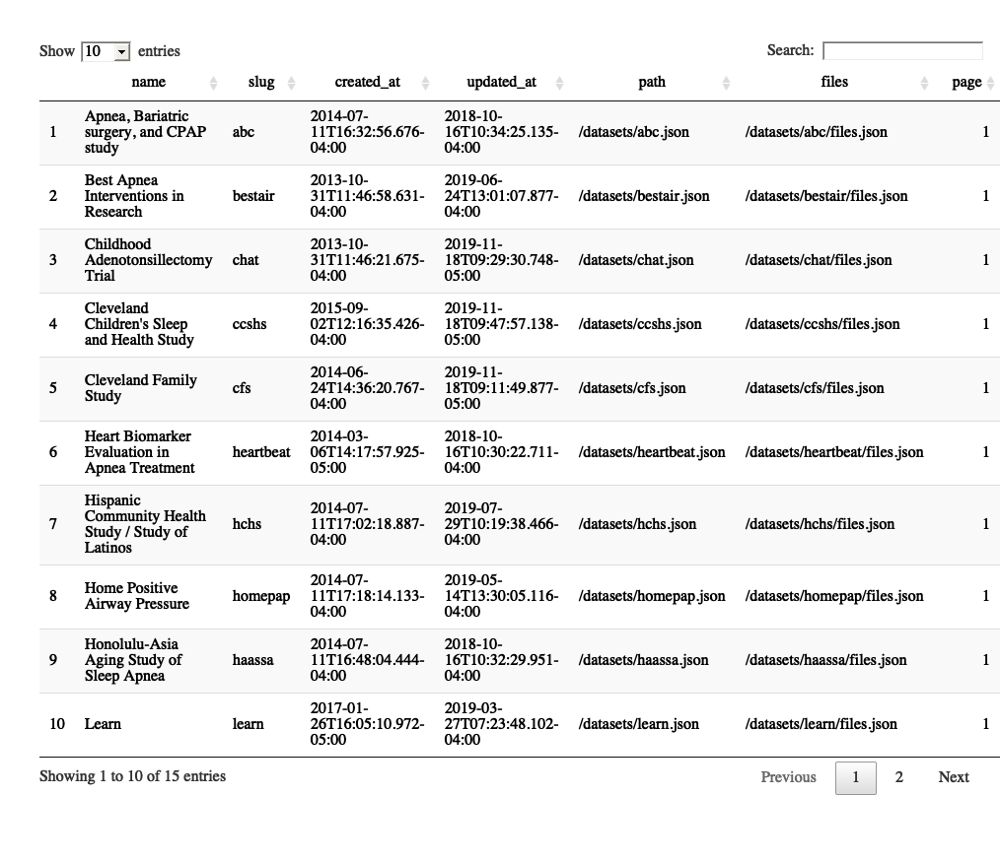

<!-- README.md is generated from README.Rmd. Please edit that file -->

# nsrr

<!-- badges: start -->

[](https://travis-ci.com/muschellij2/nsrr)
[](https://ci.appveyor.com/project/muschellij2/nsrr)
[](https://codecov.io/gh/muschellij2/nsrr?branch=master)
<!-- badges: end -->

The goal of nsrr is to allow users to access data from the National
Sleep Research Resource (’NSRR’) (<https://sleepdata.org/>) through an
`R` interface.

Why `R`? Many packages in `R` can read and process accelerometry, such
as the [`GGIR`](https://cran.r-project.org/package=GGIR),
[`ActivityIndex`](https://cran.r-project.org/package=ActivityIndex), and
[`accelerometry`](https://cran.r-project.org/package=accelerometry);
other packages such as
[`edfReader`](https://cran.r-project.org/package=edfReader) can read in
EDF data for polysomnography data. Also, the
[`xml2`](https://cran.r-project.org/package=xml2) package can easily
read in XML annotations into `R`. We believe the interplay with these
packages, amongst others, allow for a flexible framework to download,
process, and visualize data. The `nsrr` package is simply the entry
point into navigating the files available and downloading the data.

## Installation

You can install the released version of nsrr from
[CRAN](https://CRAN.R-project.org) with:

``` r
install.packages("nsrr")
```

## Token

To retrieve your NSRR token, go to <https://sleepdata.org/dashboard>,
and sign in. This token will allow you access to any data sets you have
requested access to. If you do not have access, then it will allow you
to download files that are publicly available.

Set the token by adding this to your `~/.Renviron` file:

``` r
NSRR_TOKEN="YOUR TOKEN GOES HERE"
```

The token is accessible via `token = Sys.getenv("NSRR_TOKEN")`. Each
`nsrr` function also has the argument `token` to pass through if you do
not wish to set it.

To determine if you are authenticated, you can use:

``` r
library(nsrr)
nsrr_auth()
$authenticated
[1] TRUE

$username
[1] "muschellij2"

$full_name
[1] ""

$first_name
NULL

$last_name
NULL

$email
[1] "muschellij2@gmail.com"
```

## Examples

### NSRR data sets

Here is how you can access the NSRR datasets list:

``` r
library(nsrr)
df = nsrr_datasets()
DT::datatable(df)
```



### NSRR data set files

Here we first get a list of the files in the `datasets` sub-directory
from the `shhs` data set:

``` r
df = nsrr_dataset_files("shhs", path = "datasets")
head(df)
  dataset                         full_path    folder
1    shhs                  datasets/archive datasets/
2    shhs             datasets/hrv-analysis datasets/
3    shhs             datasets/CHANGELOG.md datasets/
4    shhs           datasets/KNOWNISSUES.md datasets/
5    shhs datasets/shhs1-dataset-0.15.0.csv datasets/
6    shhs datasets/shhs2-dataset-0.15.0.csv datasets/
                 file_name is_file file_size
1                  archive   FALSE         0
2             hrv-analysis   FALSE         0
3             CHANGELOG.md    TRUE     11010
4           KNOWNISSUES.md    TRUE     11421
5 shhs1-dataset-0.15.0.csv    TRUE  24322962
6 shhs2-dataset-0.15.0.csv    TRUE  11897377
                 file_checksum_md5 archived
1                             <NA>    FALSE
2                             <NA>    FALSE
3 69bb54a32cdfc7bdddc13276b7c858c1    FALSE
4 8598129123baa60e16977dc24aa780af    FALSE
5 3f26d37ec97e2bc88776850a31715398    FALSE
6 21807d854010f036fd0d4f006eeed49d    FALSE
```

### Downloading NSRR data set files

We can then download the `CHANGELOG.md` file as it’s publicly
accessible.

``` r
url = nsrr_download_url("shhs", path = "datasets/CHANGELOG.md")
# print URL
dl = nsrr_download_file("shhs", path = "datasets/CHANGELOG.md")
dl$outfile
[1] "/var/folders/1s/wrtqcpxn685_zk570bnx9_rr0000gr/T//RtmpJUlkmk/filea17e12cd407.md"
cat(head(readLines(dl$outfile)), sep = "\n")
## 0.15.0 (November 18, 2019)

- Remove EEG spectral summary variables
- Add notes to height and weight varibles about top and bottom coding
- The CSV datasets generated from a SAS export are located here:
  - `\\rfawin\bwh-sleepepi-shhs\nsrr-prep\_releases\0.15.0\`
```

### Listing All NSRR data set files

To list all the files, recursively, you would run:

``` r
nsrr_all_dataset_files("shhs")
```

but it may take some time.

### EDF files

The [`edfReader`](https://cran.r-project.org/package=edfReader) can read
in EDF fields for polysomnography data. **Work in Progress - need access
to EDF data**.

``` r
files = nsrr_dataset_files("shhs", path= "polysomnography/edfs/shhs1")
dl = nsrr_download_file("shhs", path = "polysomnography/edfs/shhs1/shhs1-200001.edf")
```
